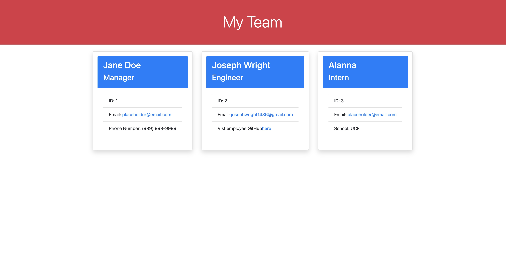

# Team Profile Generator

## Summary
This is a node.js application that uses inquirer to get information about a team to generate a Html file.
This information is gathered through the terminal by invoking the app by typing 'node index.js'. lastly, the the team classes
are tested through the use of jest.

## Technologies used

* HTML
* JavaScript
* Bootstrap
* Inquirer
* Jest
* Node.js

## Website Screenshot

## Video Demonstration
https://drive.google.com/file/d/1c-uMYr5uaYmOkFePNWXgxdl8yCm2eXG2/view